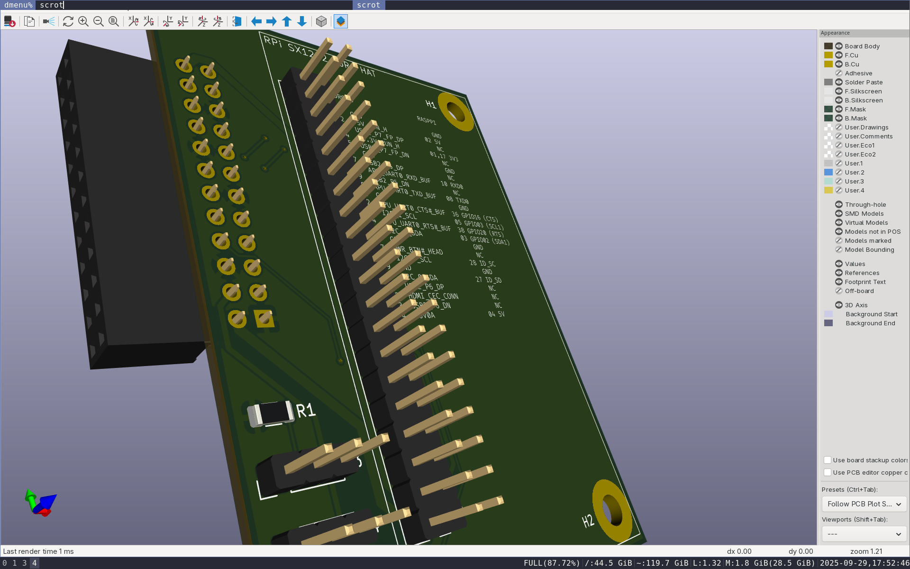
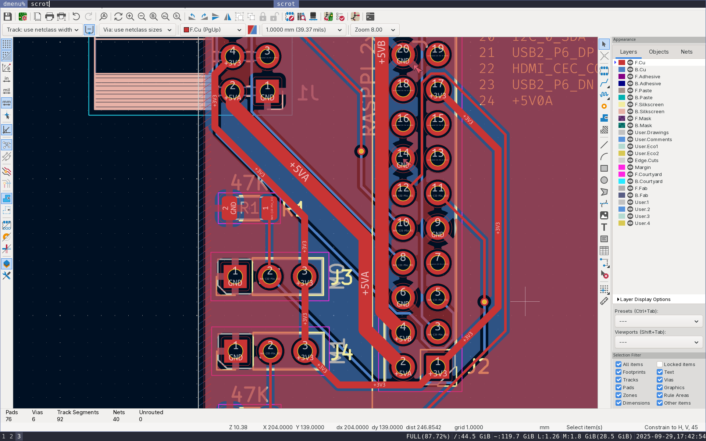
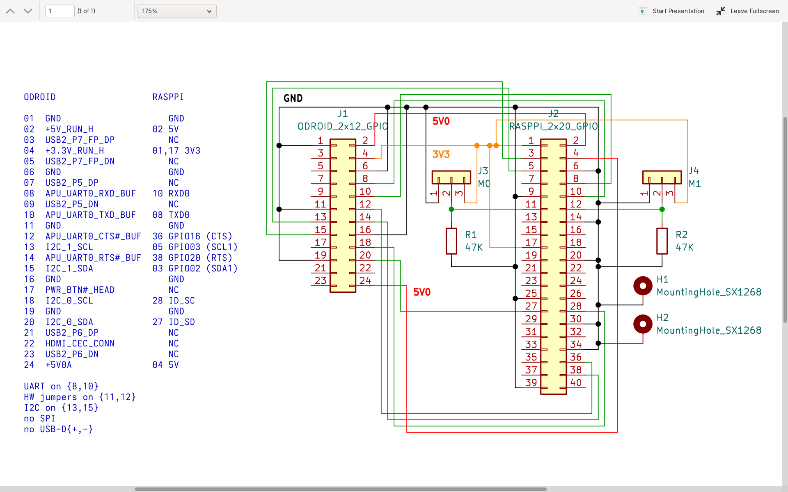
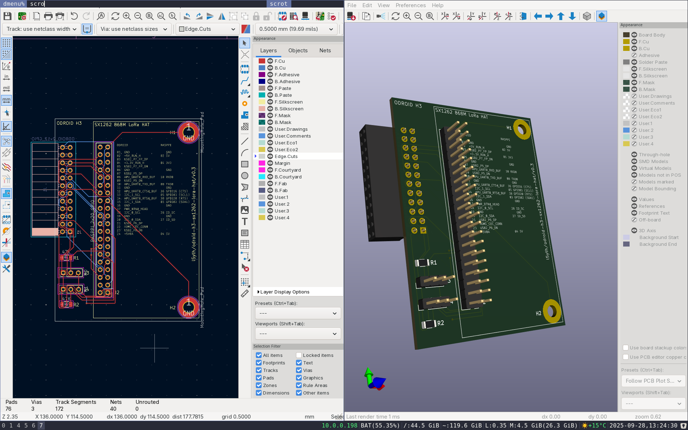

# odroid-h3-sx1268-lora-hat

Kicad files for an ODROID H3/H3+ to Raspberry-Pi pin header translator to be used with the Waveshare SX1268 LoRa hat.

* Discussion: [forum.odroid.com/topic/50464](https://forum.odroid.com/viewtopic.php?f=171&t=50464&p=400427)
* Waveshare SX1268 LoRa schematics: [files.waveshare.com/SX1268_LoRa_HAT_SchDoc.pdf](https://files.waveshare.com/upload/a/af/SX1268_LoRa_HAT_SchDoc.pdf)
* ODROID H3 schematics: [wiki.odroid.com/odroid-h3/odroid-h3_rev2.0_20220406.pdf](https://wiki.odroid.com/_media/odroid-h3/odroid-h3_rev2.0_20220406.pdf)

# LICENSE

CC0 - public domain
